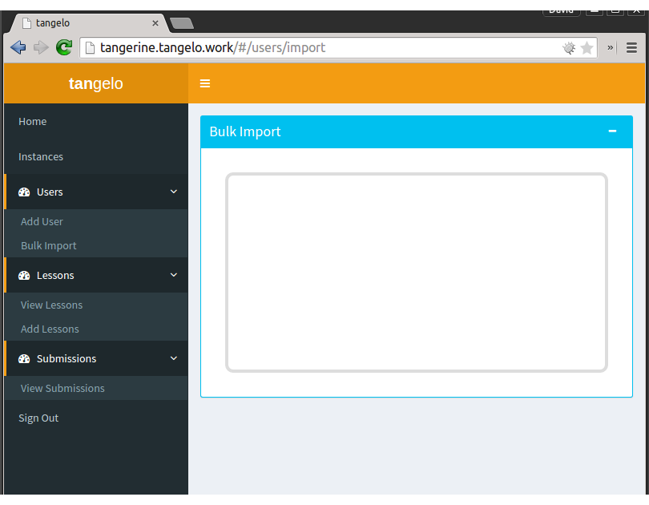

#System Functional Specification#

## User Interface Design
The user interface is meant to leverage newer browser technologies like CSS3 and HTML5. Some of the new features used is the drag-and-drop API and media queries for responsive design. 

### Admin Screens

Here is the default admin screen.

The administrator will be able to manage LXC instances here. 

The administrator will be able to upload lesson plans here. 

The administrator will be able to view uploaded lesson plans here. 

The administrator will be able to see submissions made by clients.

The administrator will be able to see a list of users here.

The adminstrator will be able to import a list of users as a CSV file here.

### Client (non-admin) Screens

The user will be able to see what lesson plans the administrator has uploaded.

The user will be able to have a scratchpad available to use like a secondary clipboard.

The user will be able to see their submissions and comments made by the administrator here. 

## System Specifications
### Authentication of users
