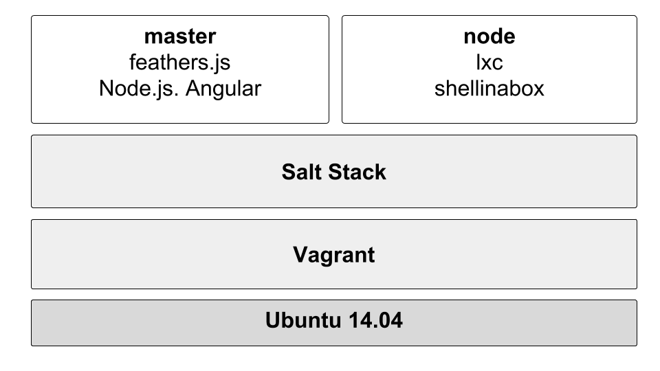
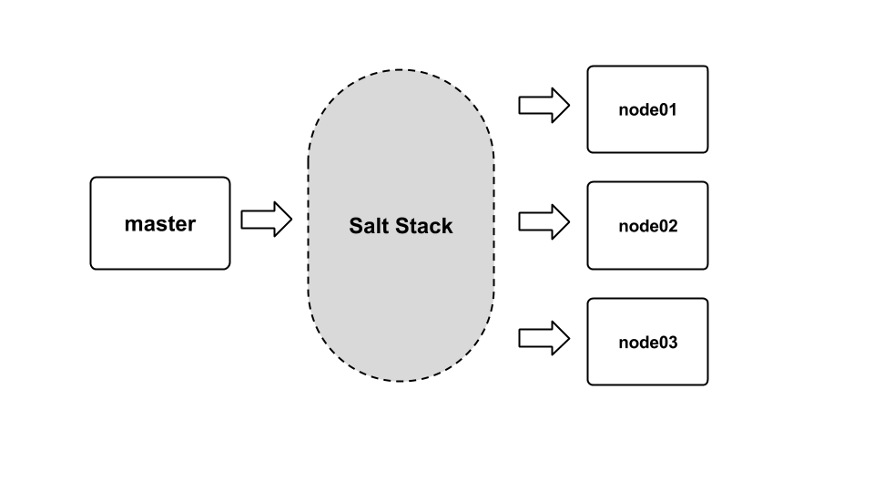
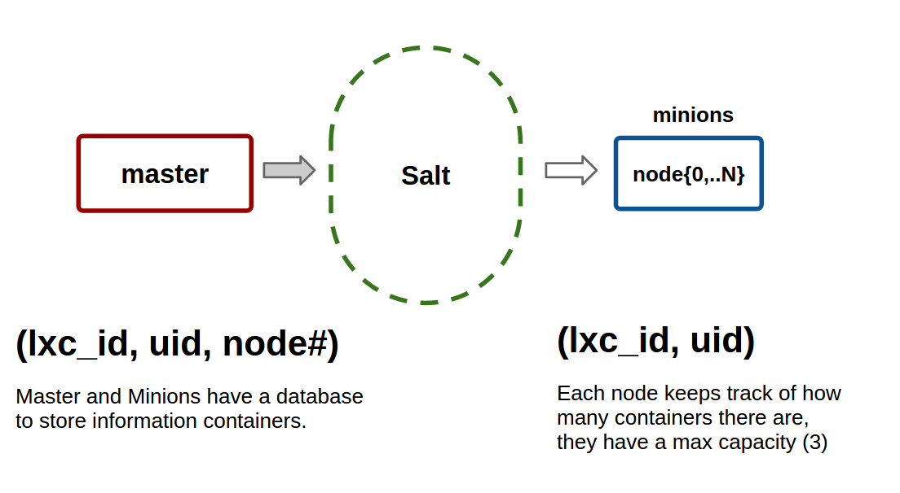

#System Design Overview#

## Stack

Below is an overview of the software stack we used for developing Tangelo

## Description of System Operation

### Communication between master and nodes

Communication between master and minion nodes is done with the Salt Stack. There is a daemon that runs on the minion and master that facilitates this. Salt modules are programs.

We are using Salt for remote execution.  The storing of configuration directives can be simply done by logging onto the master machine and then executing a command on one or many other machines at once.

Salt sets up all the individual instances of Linux. We also combine the power of Salt with simple Linux Bash commands to retrieve desired data across all running Linux instances related to information on the CPU, memory, and disk usage.

To keep track of user’s keys and login information for specific users we created a simple flat file database. 

## Equipment Configuration

Having access to DigitalOcean instances or multiple servers to deploy the software on.

Here are the requirements to build the development environment:
	
  - 100 GB Free Space
  - 8 GB RAM (16+ recommended)
  - Linux or OS X (Windows not recommended)
  - Processor that supports virtualization extensions
  - Virtualbox 

## Implementation Languages

Tangelo is implemented in the following languages:

  - Python
  - Javascript
  - PHP
  - Shell
  - C
  - HTML+CSS
  - Ruby (Vagrantfiles)

Frameworks leveraged and their intergration (grouped by usage):
	
  - Frontend
  	- Angular &mdash; Frontend UI
  	- AdminLTE &mdash; CSS Framework

  - Backend
  	- FeathersJS &mdash; API
  	- Mongoose-Feathers &mdash; API
  	- LXC &mdash; Linux Containers
  	- Vagrant &mdash; Virtual machine management and installer

## Required Support Software

Ubuntu 14.04 and git is the bare minimum is required to run the installer. Vagrant and Virtualbox is needed to run the development environment.
